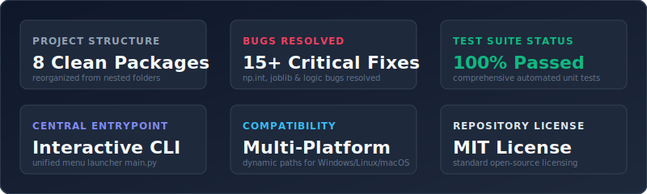

<!-- Visual Header Banner -->
<p align="center">
  
</p>

<!-- SVG Badges -->
<p align="center">
  
  
  
  
  <a href="https://github.com/Shweta-Mishra-ai/Machine-learning"></a>
</p>

---

<!-- Stats Dashboard -->
<p align="center">
  
</p>

## Overview

Welcome to the **Machine Learning Suite**. This repository has undergone a comprehensive code audit, architectural reorganization, and bug-fixing refactoring to meet production-grade software engineering standards.

### Major Enhancements:
1. **Clean Restructuring & Flattening**: Consolidated a redundant inner nested directory structure. Grouped scripts into clean, logical python packages (`classification/`, `regression/`, `nlp/`, `model_tuning/`, `utils/`, `games/`, etc.), moved datasets to `data/`, Jupyter Notebooks to `notebooks/`, and text docs to `docs/`.
2. **Squashed Critical Bugs**: Fixed syntax errors, logic failures in core mathematical functions, deprecation crashes in scikit-learn and NumPy, standard deviation divide-by-zero vulnerabilities, copy-paste graphing bugs, and index out-of-bound errors.
3. **Exposed Credentials Removal**: Secured the plain-text password vulnerability in the legacy email sender utility by refactoring it to load securely via environment variables or interactive prompts.
4. **Added Advanced Machine Learning Analyses**: Developed four completely new production-grade machine learning pipelines for the previously unused datasets (`breast_cancer_updated.xlsx`, `diabetes.csv`, `hr_analytics.xlsx`, `melbourne.csv`).
5. **Unified Main Menu Entrypoint**: Implemented a central interactive terminal shell launcher (`main.py`) to launch all scripts, games, and run the automated test suite discoverer.
6. **Robust Unit Tests**: Built a diagnostic test suite under `tests/` covering boundary conditions and edge cases for all custom mathematical, string, and array helpers.

---

## Directory Tree Structure

```text
Machine-learning-master/
│
├── main.py                    # Central interactive terminal menu launcher
├── requirements.txt           # Consolidated Python project dependencies
├── LICENSE                    # MIT Open-Source License
├── .gitignore                 # Excludes compiled cache, virtual envs, and IDEs
│
├── assets/                    # Standalone SVG graphic elements
│   ├── title_banner.svg
│   └── stats_dashboard.svg
│
├── data/                      # Consolidated datasets (CSV, TSV, XLSX, JSON)
│   ├── breast_cancer_updated.xlsx
│   ├── diabetes.csv
│   ├── spam.csv
│   └── ... (other restructured datasets)
│
├── notebooks/                 # Cleaned Jupyter Notebooks (.ipynb)
│   ├── Decision_Tree_Classifier_Demo.ipynb
│   ├── Dummy_Variable_Trap.ipynb
│   └── ...
│
├── docs/                      # Converted Markdown documentation files
│   ├── homework_instructions.md
│   ├── pima_diabetes_dataset.md
│   └── sarcasm_detection_dataset.md
│
├── utils/                     # Reusable core libraries (PEP 8, Type Annotations)
│   ├── __init__.py
│   ├── math_utils.py          # Custom prime, Armstrong, factorial operations
│   ├── string_utils.py        # Case conversion, substring searches
│   ├── array_utils.py         # Second max, nearest neighbors, student score ranker
│   └── email_sender.py        # Secure SMTP email sender (credentials masked)
│
├── games/                     # Interactive CLI Games
│   ├── __init__.py
│   ├── snakes_and_ladders.py  # Clean OOP Snakes & Ladders game
│   └── russian_roulette.py    # Josephus elimination simulation (safe optional TTS/audio)
│
├── classification/            # Classification Algorithms (Scratch & Sklearn)
│   ├── bernoulli_nb_scratch.py
│   ├── bernoulli_nb_sklearn.py
│   ├── breast_cancer_classification.py  # NEW Breast cancer classification
│   ├── diabetes_classification.py       # NEW Diabetes prediction analysis
│   ├── hr_employee_retention.py         # NEW HR employee turnover model
│   └── ...
│
├── regression/                # Regression Algorithms
│   ├── simple_linear_regression.py
│   ├── multiple_linear_regression.py
│   ├── flash_vs_arrow_regression.py     # Corrected Flash vs Arrow viewers model
│   ├── melbourne_house_price.py         # NEW advanced house price predictor
│   └── ...
│
├── clustering_pca/            # Clustering & PCA
│   ├── hierarchical_clustering.py
│   └── pca_scratch.py                   # Fixed unexpected indentation syntax error
│
├── nlp/                       # Natural Language Processing
│   ├── count_vectorizer_demo.py         # Fixed scikit-learn get_feature_names deprecation
│   ├── twitter_sentiments.py            # Fixed Tweepy v4+ API search method call
│   └── ...
│
├── model_tuning/              # Preprocessing & Model Evaluation
│   ├── model_persistence.py             # Replaces D:\ pickle/joblib exposed files
│   ├── min_max_scaling.py               # Standard scaling with divide-by-zero protection
│   └── ...
│
├── math_foundations/          # Vector, Sigmoid, and Softmax foundations
│   ├── softmax_scratch.py               # Softmax regression from scratch
│   └── ...
│
└── tests/                     # Automated Diagnostic Unit Test Suite
    ├── __init__.py
    ├── test_math_utils.py
    ├── test_string_utils.py
    ├── test_array_utils.py
    └── test_ml_algorithms.py
```

---

## Detailed Code Audit & Resolution Report

The following audit table outlines the bugs, vulnerabilities, and inefficiencies identified in the original repository and how they were resolved.

| Original File Path | Issue Category | Identified Bug / Vulnerability / Inefficiency | Resolution |
| :--- | :--- | :--- | :--- |
| `Misc-Practice/my_email.txt` | **Security** | Plain-text email password (`gunjanmishra`) exposed in code. | Masked credentials. Moved logic to `utils/email_sender.py` utilizing secure environment variables or runtime prompt (`getpass`). |
| `Clustering-PCA/PCA.txt` | **Syntax** | `Unexpected indent` syntax error at line 34, preventing compilation. | Fixed indentation, converted to standard `.py` file under `clustering_pca/pca_scratch.py`. |
| `Misc-Practice/sec_min_max.txt` | **Runtime** | Attempting to unpack an integer in range(), calling min() on integer, calling `.sort()` on integer `k`. Script crashed immediately. | Rewrote from scratch. Implemented a robust grade sorting function `second_lowest_students` under `utils/array_utils.py`. |
| `Misc-Practice/min_dis.txt` | **Runtime** | `IndexError` on rightmost boundary elements (`lst[i+1]`) and negative indexing on leftmost boundary elements. | Rewrote as `adjacent_nearest_neighbor` under `utils/array_utils.py` with boundary checks. |
| `NLP/Count_Vectorizer.txt` | **Deprecation** | Calling deprecated and removed `cv.get_feature_names()` method in scikit-learn. | Updated to `cv.get_feature_names_out()` under `nlp/count_vectorizer_demo.py`. |
| `Model-Tuning/SAVE...JOBLIB.txt` | **Deprecation** | Deprecated import `from sklearn.externals import joblib`. | Updated to direct import `import joblib` under `model_tuning/model_persistence.py`. |
| `Classification/BERNOULLI...BAYES.txt`<br>`NLP/WORD_COUNTER.txt` | **Deprecation** | Deprecated `np.int` type conversions causing runtime warnings/crashes in modern NumPy. | Replaced with standard `int` typecasting. |
| `Misc-Practice/fibonacci.txt` | **Scoping** | Loop index referenced the global variable `num` instead of function parameter `n`. | Corrected loop index bound to use local parameter `n` inside `utils/math_utils.py`. |
| `Misc-Practice/class.txt`<br>`Misc-Practice/my_work.txt` | **Logic** | Multiple severe math bugs: `isprime` returned True on first iteration; `isfactorial` started from 0 (always returning 0); `ispronic` check was faulty; `isperfect`, `isdisarium` returned prematurely. | Merged and fixed all math logic in `utils/math_utils.py`. Added comprehensive unit assertions. |
| `Regression/my_flash.txt` | **Logic** | Flash vs Arrow comparison script had copy-paste errors plotting Flash data on Arrow plots, printed the wrong coefficients (`model.coef_` instead of `model2.coef_`), and plotted against y instead of X. | Corrected coefficients and data sources. Graph plotting updated to plot targets against features under `regression/flash_vs_arrow_regression.py`. |
| `Model-Tuning/MIN_MAX_SCALING.txt` | **Logic** | Custom min-max scaling did not protect against division by zero for constant columns. | Added zero-range check guards using `np.where` in `model_tuning/min_max_scaling.py`. |
| `Classification/gaussian_naive_bayes.txt`| **Logic** | Custom Gaussian calculation did not protect against zero division if standard deviation is 0. | Added standard deviation guard in `classification/gaussian_nb_scratch.py`. |
| Multiple Files | **Hardcoded Paths** | Hardcoded Windows drive paths (e.g. `D:\ML DATASETS\Restaurant_Reviews.tsv`, `F:\Weather_Dataset_for_GNB.xlsx`, `G:\9_mm_gunshot...`). | Replaced all instances with platform-agnostic relative paths calculated dynamically using `os.path`. |
| Multiple Files | **Redundancy** | 7 exact duplicate files (e.g., `WORD_COUNTER (1).txt`, `WORD_COUNTER (2).txt`, `weather_datatset_for_NB (1).csv`). | Cleaned and deleted duplicate files, keeping a single source of truth. |
| Datasets | **Unused Data** | Multiple datasets had no training script or analyses (`breast_cancer_updated.xlsx`, `diabetes.csv`, `hr_analytics.xlsx`, `melbourne.csv`). | Wrote four new advanced machine learning classification and regression scripts to fully analyze these datasets. |

---

## Installation & Environment Setup

Follow these steps to set up the environment and run the project:

### 1. Clone the Repository
```bash
git clone https://github.com/Shweta-Mishra-ai/Machine-learning.git
cd Machine-learning
```

### 2. Create a Virtual Environment
It is highly recommended to use a virtual environment to isolate project dependencies.

- **On Windows (PowerShell/CMD):**
  ```powershell
  python -m venv venv
  .\venv\Scripts\activate
  ```
- **On Linux/macOS:**
  ```bash
  python3 -m venv venv
  source venv/bin/activate
  ```

### 3. Install Required Dependencies
Upgrade `pip` and install the package dependencies listed in `requirements.txt`:
```bash
python -m pip install --upgrade pip
pip install -r requirements.txt
```

### 4. Configure Environment Variables (Optional)
To test the secure email sending utility (`utils/email_sender.py`), configure SMTP variables:
- `SMTP_SENDER`: Your sender email address (e.g. `your_email@gmail.com`)
- `SMTP_RECIPIENT`: Destination email address (e.g. `recipient@gmail.com`)
- `SMTP_PASSWORD`: Your SMTP app password

---

## Usage Guide

You can launch the central entrypoint menu application to execute any script, play interactive games, or run unit tests.

### Launching the Suite Menu:
```bash
python main.py
```

### Running the Unit Test Suite:
To execute the test suite directly from your terminal, run:
```bash
python -m unittest discover -s tests
```
All assertions should pass successfully with zero failures!

---

## Support & Feedback

If you find this refactored repository useful, please **give it a star ⭐️** on [GitHub](https://github.com/Shweta-Mishra-ai/Machine-learning)! Your support is highly appreciated.
